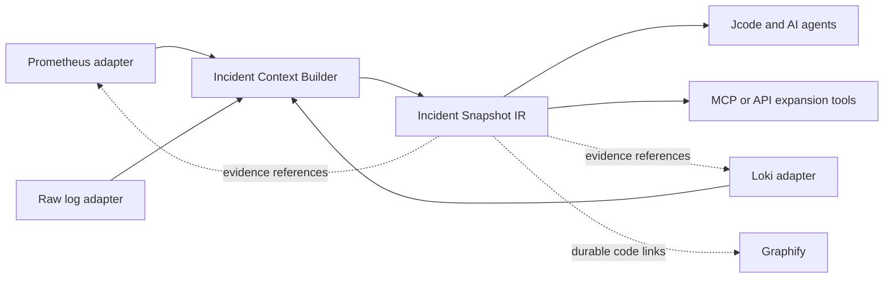

# Architecture

The package is the deterministic core. It has no network or persistence dependency. Adapters gather
bounded evidence and pass normalized source records to the builder. A future service can host the
same package without moving domain rules into HTTP handlers.

## Invariants

1. Raw evidence is never overwritten or copied into the IR unnecessarily.
2. Model-facing facts retain source provenance.
3. Redaction precedes model-facing serialization.
4. Severe and rare protected categories are considered before dominant ordinary traffic.
5. Missing or omitted evidence is visible through completeness metadata.
6. Graphify receives durable code relationships, not transient log-event nodes.

## Delivery milestones

1. Deterministic log vertical slice. Implemented.
2. Bounded Loki and Prometheus adapters with baseline and delta analysis. Implemented.
3. Timeline, stack fingerprints, deployment markers, and correlation confidence. Implemented.
4. Jcode Context Compiler and progressive L0/L1/L2 expansion tools.
5. Self-hosted API/MCP service with tenant isolation, RBAC, audit, and rate limits.
