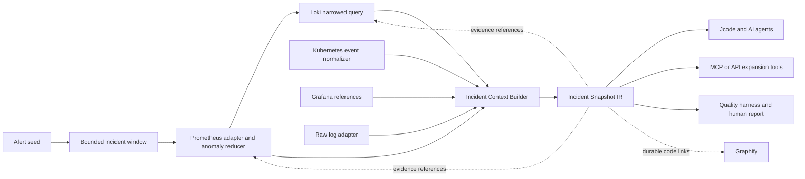

# Architecture

The package is the deterministic core. It has no network or persistence dependency. Adapters gather
bounded evidence and pass normalized source records to the builder. A future service can host the
same package without moving domain rules into HTTP handlers.

## Invariants

1. Raw evidence is never overwritten or copied into the IR unnecessarily.
2. Model-facing facts retain source provenance.
3. Redaction precedes model-facing serialization.
4. Severe and rare protected categories are considered before dominant ordinary traffic.
5. Missing or omitted evidence is visible through completeness metadata.
6. Graphify receives durable code relationships, not transient log-event nodes.
7. Query windows, item counts, token budgets, and cache lifetimes are bounded.
8. Every compact metric, infrastructure event, report claim, and code reference keeps provenance.

## Delivery milestones

1. Deterministic log vertical slice. Implemented.
2. Bounded Loki and Prometheus adapters with baseline and delta analysis. Implemented.
3. Timeline, stack fingerprints, deployment markers, and correlation confidence. Implemented.
4. Jcode-compatible Context Compiler, progressive L0/L1/L2 expansion tools, and durable Graphify
   code references. Implemented.
5. Self-hosted API/MCP reference service with tenant isolation, RBAC, audit, payload bounds, and
   rate limits. Implemented.
6. Alert/window orchestration, metric-first narrowing, infrastructure/Grafana IR, bounded
   observability tools, cardinality/cache telemetry, and incident-quality evaluation. Implemented.

See `phase-completion-matrix.md` for the requirement-to-check map across all 48 phases.

The reference service intentionally uses in-memory auth, audit, rate-limit, and context stores.
Production persistence, distributed quotas, Vault-backed credentials, TLS termination, and
deployment manifests remain hosting concerns rather than deterministic-core behavior.
