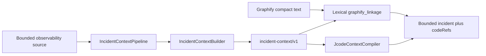

# Runtime-to-code correlation: current architecture

Status: Phase 0 discovery and Gate 0 proposal  
Evidence date: 2026-08-11

## 1. Scope and evidence base

This document records facts from the current implementations before runtime-to-code correlation is added. It covers:

- Incident Context Engine at commit `6f32a158d883df70a784e56e05487518f4de62b7`;
- BugZero SaaS at commit `b58c3936322d58cb4bcc3887096896009ba7c22a`;
- installed Graphify `0.9.37` from `Graphify-Labs/graphify` and an Incident Context graph built at commit `c0e0355de4be8a429104050130300bff693793e3`;
- OrangeHat infrastructure at commit `69ffc8e049301d371ff3fbfedceab5b423cb3e3f`.

CodeFlow was inspected because it is registered as an architecture-visualization project, but it does not contain the installed Graphify implementation or Graphify APIs. Runtime-to-code work must target Graphify itself, not CodeFlow.

## 2. Current system boundaries

### 2.1 Incident Context Engine

Incident Context Engine is a Python 3.11+ package with no required runtime dependencies. Its deterministic core converts bounded observability records into `incident-context/v1` snapshots.

Current responsibilities:

- typed log, metric, infrastructure, deployment, Grafana, timeline, stack, and correlation IR;
- deterministic normalization, fingerprinting, aggregation, ranking, omission accounting, and redaction;
- bounded Loki and Prometheus adapters;
- metric-first incident narrowing;
- progressive L0/L1/L2 disclosure through `JcodeContextCompiler`;
- an HTTP/MCP reference service;
- a fail-closed pre-LLM `ContextFirewall`;
- a trusted `ObservabilitySourceResolver` boundary keyed by `tenant_id + source_id`.

Current central types are in `src/incident_context/models.py`:

- `EvidenceRef` validates source-owned evidence references;
- `LogEvent` represents raw input before reduction;
- `BuildRequest` validates scope, budget, source records, and time bounds;
- `IncidentPattern`, `StackFingerprint`, `MetricAnomaly`, `TimelineEntry`, and related types form the compact snapshot;
- `IncidentContext` is the versioned model-facing IR.

The HTTP/MCP service in `src/incident_context/service.py` currently provides:

- API-key principals containing a `tenant_id` and roles;
- tenant-scoped context retrieval and audit listing;
- bounded payload parsing and result limits;
- role checks and rate limiting;
- context build/read/expand and focused observability read tools.

The reference implementations of API-key storage, rate limiting, audit storage, context storage, and source resolution are in-memory. They are suitable for embedding and tests, not horizontally scaled production hosting.

There are 78 test functions across 14 test modules covering adapters, source pipelines, correlation, compiler behavior, Graphify linkage, HTTP/MCP, tenant isolation, SaaS integration, evaluation, edge cases, and quality scenarios.

### 2.2 Existing Graphify linkage in Incident Context

`src/incident_context/graphify_linkage.py` accepts Graphify compact text as an opaque string. It:

1. extracts incident terms from scope, retained patterns, services, exception types, and frames;
2. parses `NODE ... [metadata]` lines;
3. ranks nodes by lexical overlap;
4. emits bounded `DurableCodeReference` values;
5. combines references with L0/L1/L2 Incident Context output under a token budget.

This is not runtime-to-code correlation:

- it has no source-anchor index;
- it does not share canonicalization with runtime patterns;
- it does not resolve deployment revisions;
- it hashes the compact line to create a local reference revision rather than using a repository revision;
- it cannot distinguish emission site, exception site, hotspot, or root-cause candidate;
- it has no ambiguity, contradiction, or multi-signal confidence model.

It should remain available as a compatibility fallback while the typed graph lookup path is introduced.

### 2.3 BugZero SaaS

BugZero SaaS is a Node.js 22 npm workspace. The integration-service is the current control-plane boundary for API keys and product runs.

Current tenancy model:

- organizations are the top-level SaaS tenant;
- projects contain a mandatory `organization_id` foreign key;
- API keys, product runs, audit events, usage, billing, and related data carry `organization_id`;
- queries commonly scope by organization and optionally project;
- internal Fastify services use an HMAC request signature from `SERVICE_AUTH_SECRET`.

Current gaps relevant to correlation:

- there is no repository mapping table;
- there is no service/environment-to-repository mapping;
- there is no deployment, artifact, image-digest, Git SHA, or Graphify revision model;
- there is no incident-context persistence/control-plane API;
- there is no runtime-to-code correlation schema;
- there is no complete Prometheus/Loki/Grafana service instrumentation contract.

`docs/INCIDENT_CONTEXT_ENGINE_INTEGRATION.md` already establishes important constraints:

- Incident Context must be internal and read-only;
- it must not enter login, billing, webhook, email, project, or test-run critical paths;
- telemetry collection must precede production datasource integration;
- the integration-service or a dedicated internal adapter must authorize organization/project/run scope;
- callers must not provide arbitrary Loki, PromQL, Grafana, filesystem, or Kubernetes selectors;
- cross-tenant negative tests are mandatory;
- the service should be ClusterIP-only with narrowly scoped network access.

### 2.4 Graphify

The installed implementation is `graphifyy 0.9.37`, Apache-2.0, from `https://github.com/Graphify-Labs/graphify`.

Graph schema facts from generated `graphify-out/graph.json`:

- top-level fields include `built_at_commit`, `directed`, `multigraph`, `nodes`, `links`, and `hyperedges`;
- the graph is currently exported as undirected and non-multigraph;
- nodes contain an `id`, `label`, `file_type`, `source_file`, `source_location`, `_origin`, and optional community/type metadata;
- links contain `source`, `target`, `relation`, `context`, `confidence`, `confidence_score`, `source_file`, `source_location`, `_origin`, and `weight`;
- `built_at_commit` records the repository HEAD for the generated graph.

Identity facts:

- file node IDs are deterministic normalized values derived from a scan-root-relative path with no extension;
- symbol IDs are deterministic normalized combinations of file/scope/name produced by language extractors;
- line information is metadata (`source_location` such as `L42`), not part of the file node ID;
- the generated graph does not make repository identity or source revision part of each node ID;
- repository plus `built_at_commit` must therefore scope a graph revision externally.

Extraction facts:

- Graphify uses Tree-sitter-based AST extraction with language-specific extractors and resolver passes;
- supported installed grammars include Python, JavaScript, TypeScript, Go, Rust, Java, Groovy, C, C++, Ruby, C#, Kotlin, Scala, PHP, Swift, Lua, Zig, PowerShell, Elixir, Objective-C, Julia, Verilog, Fortran, Bash, and JSON, with optional SQL, Pascal, DM, and HCL extras;
- `_get_extractor()` dispatches by filename, manifest kind, suffix, shebang, and limited language sniffing;
- extraction is cached per file and can run in parallel;
- there is no public runtime-observability-anchor plugin contract today;
- public integration is primarily CLI/file based (`extract`, `update`, `query`, `explain`, `affected`, `merge-graphs`, and MCP), not a typed Python `SourceGraphLookup` API.

Graphify currently has general `calls`, `references`, `imports`, `contains`, and related code edges. It does not expose first-class `LOG_TEMPLATE`, `LOGGER`, `EXCEPTION_THROW`, `METRIC`, `EVENT`, or `TRACE_SPAN` anchor records in the inspected output.

### 2.5 OrangeHat infrastructure

OrangeHat infrastructure is an Ansible repository with per-project playbooks and shared dev/prod inventory. It currently has no BugZero or Incident Context Engine project playbook.

Infrastructure constraints:

- secrets remain encrypted in environment vault files;
- deployment changes must identify project, environment, namespace, inventory, and playbook;
- local syntax/template validation precedes any deployment;
- no production deploy, restart, migration, scaling, or secret change is part of this implementation without separate approval.

BugZero SaaS also contains its own Kubernetes base and stage/production overlays. Those manifests use versioned container tags but currently expose no Git SHA or immutable artifact-to-revision mapping.

## 3. Current end-to-end flow



The current code reference path is lexical enrichment after incident construction. It does not correlate runtime evidence against indexed source observability anchors.

## 4. Required target boundaries

### 4.1 Open-source Incident Context / correlation core

The independently useful OSS layer should own:

- `RuntimeEvidence` and its evidence-specific payloads;
- `ObservabilityAnchor`;
- `SourceCallsite`;
- canonicalization and stable fingerprints;
- revision-quality, signal, contradiction, candidate, result, and hotspot schemas;
- deterministic matching and confidence bands;
- ambiguity and unavailable/degraded states;
- generic `SourceGraphLookup` and source-indexer protocols;
- OSS-safe language/framework adapters;
- deterministic fixtures and benchmark harness.

The OSS core must not depend on BugZero tenancy types, databases, customer datasource configuration, billing, Graphify internals, or proprietary change intelligence.

### 4.2 Graphify

Graphify should own source extraction and durable graph representation of runtime-observable constructs:

- static log templates and logger identity;
- source locations and enclosing symbols;
- exception throw/catch/wrap relations where reliable;
- static metric, event, and span names;
- incremental deletion/reindex behavior;
- query/export support for batched anchor lookup.

Graphify should reuse its existing node and relation conventions. Observability anchors may be dedicated nodes or typed metadata, but must not create a second code graph. Repository and source revision remain explicit lookup scope even if node IDs stay revision-independent.

### 4.3 BugZero private control plane

BugZero should own:

- organization/project authorization;
- repository registration and project mappings;
- service/environment-to-repository mappings;
- deployment, artifact, image digest, Git SHA, and Graphify revision resolution;
- tenant-scoped `GraphifySourceGraphLookup`;
- Incident Context orchestration and persistence;
- support-facing BFF/API and agent tools;
- audit, usage, policies, and customer-specific configuration;
- change-aware ranking and historical incident intelligence.

Every private lookup key must include organization, project, repository, service/environment, and revision as applicable.

### 4.4 OrangeHat infrastructure

Infrastructure should eventually own the deployable service definition:

- image build/release references;
- stage and production configuration;
- ClusterIP service and NetworkPolicy;
- service account with no Kubernetes mutation or secret-read permissions;
- Vault-backed API and datasource credentials;
- persistence, rate-limit, and cache dependencies selected for production;
- health/readiness, resource bounds, and observability.

Infrastructure implementation is deferred until application interfaces and persistence needs are frozen. Deployment remains a separate approval gate.

## 5. Proposed v1 module boundaries

Within Incident Context Engine:

```text
src/incident_context/runtime_code/
  models.py             # frozen v1 schemas and enums
  canonicalization.py   # versioned framework-aware normalization
  fingerprint.py        # stable template/anchor fingerprints
  lookup.py             # SourceGraphLookup protocol and batch requests
  matcher.py            # deterministic tiered correlation
  scoring.py            # independent-signal confidence and contradictions
  hotspots.py           # evidence diversity aggregation
  adapters/
    base.py              # ObservabilitySourceIndexer protocol
    java_logging.py      # first source/runtime canonicalization adapter
```

Integration points:

- `IncidentContext` gains optional bounded runtime evidence/correlation summaries without embedding raw evidence;
- `JcodeContextCompiler` gains bounded hotspot and correlation disclosure;
- the existing `graphify_linkage.py` remains a compatibility fallback, not the primary matcher;
- the service gains focused read methods only after typed contracts and tenant-scoped orchestration exist.

Within BugZero SaaS, likely private additions are:

```text
packages/runtime-code-contracts/   # generated/imported boundary types if needed
apps/integration-service/          # authorized orchestration API
packages/database/sql/             # repository/deployment/revision mappings
```

A dedicated service may replace integration-service ownership if its scope becomes too large. The security boundary remains the same.

## 6. Proposed v1 contract decisions for Gate 0 review

These decisions must be accepted before parallel implementation.

1. **Schema versioning**: all public payloads carry `schema_version`; canonicalization and matcher versions are separate fields.
2. **Evidence identity**: `RuntimeEvidence.id` is stable within its incident/source observation and always retains an `EvidenceRef`.
3. **Template identity**: a template fingerprint depends only on canonicalization version plus canonical template.
4. **Callsite identity**: repository, revision, graph node ID, source file/range, owner symbol, anchor kind, and anchor fingerprint are explicit.
5. **Revision quality**: `EXACT`, `NEAREST_KNOWN`, `HEAD_ONLY`, and `UNKNOWN`; only `EXACT` can support exact line evidence.
6. **Result status**: `MATCHED`, `AMBIGUOUS`, `UNRESOLVED`, `UNAVAILABLE`, and `DEGRADED_REVISION`.
7. **Confidence bands**: `EXACT`, `HIGH`, `MEDIUM`, `LOW`, and `UNRESOLVED`; semantic-only evidence cannot produce `EXACT`.
8. **Signal independence**: repeated occurrences of one pattern are one signal family; diversity reinforces confidence, duplication does not.
9. **Contradictions**: conflicting deterministic signals are retained and can only lower confidence.
10. **No forced winner**: close candidates remain `AMBIGUOUS` and are returned in deterministic order.
11. **Lookup isolation**: the OSS protocol accepts repository and revision scope; BugZero adds mandatory organization/project enforcement around every call.
12. **Failure independence**: Incident Context compression continues when graph lookup or correlation is unavailable.
13. **Root-cause separation**: emission/exception/metric sites are not labeled root causes by correlation alone.
14. **Bounds**: input evidence count, candidate count, graph expansions, token budget, and lookup batches have explicit maxima.
15. **Redaction**: model-facing and persisted correlation representations contain no credentials or raw source bodies by default.

## 7. Open questions requiring owner decisions

1. Graphify is not registered as an OrangeHat local project. Contribution workflow and fork location must be established before Graphify implementation.
2. Decide whether first-class Graphify anchors are nodes, typed edge metadata, or both. The answer must preserve incremental deletion and existing graph compatibility.
3. Decide whether Graphify exposes a typed batch API/MCP tool, a versioned export file, or both for `SourceGraphLookup`.
4. Select the production persistence boundary for contexts, correlations, deployment mappings, audit, and immutable caches.
5. Select the authoritative artifact source for image digest/build-to-Git-SHA mapping.
6. The first language/framework is TypeScript/JavaScript. The BugZero engine is a TypeScript ESM package and its runtime telemetry is emitted through `LokiClient` with structured message/fields, while the codebase also contains extensive `console.*` callsites. Java/SLF4J remains the next enterprise adapter, not the first adapter.
7. Decide whether the OSS runtime-code package remains inside this repository or is later extracted as a standalone package.

## 8. Gate 0 acceptance checklist

- [x] Current Incident Context schemas and correlation/compiler surfaces are documented from code.
- [x] Current Graphify schema, IDs, revision metadata, extraction dispatch, languages, and public integration are documented from installed source and generated output.
- [x] Current BugZero tenancy, service-auth, persistence, integration-service, and deployment metadata gaps are documented from code.
- [x] Current OrangeHat infrastructure conventions and deployment boundary are documented.
- [x] OSS/private/infrastructure ownership is explicit.
- [x] Proposed module boundaries are explicit.
- [x] Proposed v1 contract decisions are explicit.
- [x] Owner delegates research and Gate control to the lead agent; Gate 0 architecture and boundary review is accepted.
- [x] Use the registered local Graphify fork checkout for Graphify implementation and upstream-compatible review.

No implementation branch may invent incompatible schemas before the v1 contracts are frozen at Gate 1.
