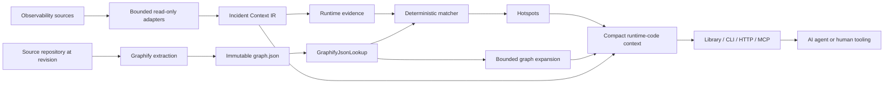

# Incident Context Engine and Graphify OSS architecture

Status: canonical OSS architecture  
Last verified: 2026-08-12  
Audience: library users, source-index maintainers, observability platform engineers, and agent-tool authors

## 1. Purpose

Incident Context Engine (ICE) is a deterministic, loss-aware layer between observability sources and AI agents. It reduces bounded runtime evidence, preserves provenance and omissions, correlates retained evidence with source code, and emits compact model-facing context.

Graphify supplies the durable source graph. ICE supplies runtime normalization, matching, confidence, hotspots, bounded expansion, and progressive disclosure.

This document covers only the public OSS architecture. It intentionally excludes proprietary product schemas, private infrastructure, customer environments, tenant names, internal endpoints, and organization-specific deployment procedures.

```text
observability evidence
 -> bounded adapters
 -> deterministic incident IR
 -> runtime evidence
 -> revision-scoped source lookup
 -> matched symbols and hotspots
 -> bounded graph expansion
 -> compact context for an agent
```

Raw evidence remains in its source backend. The source graph contains durable code facts, not transient runtime events.

## 2. Compatibility baseline

| Component | Compatible baseline | Notes |
|---|---|---|
| Incident Context Engine | `0.7.0` capability line | Python 3.11+, dependency-free runtime core, bounded adapters, runtime-code v1 contracts |
| Graphify | `graphifyy 0.9.40` export schema plus the observability-anchor capability set below | `graph.json`, `built_at_commit`, observability anchors, enclosing symbols, code-topology links |

The runtime-to-code path requires more than the unmodified Graphify `v0.9.40` tag. The validated capability commits are:

| Commit | Public capability |
|---|---|
| `17e15c9` | TypeScript/JavaScript static and dynamic log-callsite anchors |
| `b5cdebb` | Fingerprints over versioned canonical-template material |
| `dc93ec3` | Matching source/runtime whitespace normalization |
| `2b36de8` | Java SLF4J log-callsite anchors and Java enclosing-symbol attribution |

Compatibility is defined by exported behavior, not package version alone. A source graph is runtime-correlation compatible when it satisfies the schema and fingerprint contract in section 6.

Older graphs without observability anchors remain useful for ordinary topology or lexical code references. They cannot support exact template-fingerprint lookup and must produce an honest degraded or unresolved result.

## 3. Architecture



### Incident Context Engine responsibilities

- validate bounded build requests and evidence references;
- normalize and redact runtime data before model-facing serialization;
- aggregate repeated logs into stable patterns;
- preserve severe, rare, first-failure, metric, stack, timeline, and deployment evidence under explicit budgets;
- report completeness, omissions, query counts, and truncation;
- canonicalize runtime log patterns using the same public version as source anchors;
- query a bounded `SourceGraphLookup` implementation;
- score independent signal families deterministically;
- preserve ambiguity, contradiction, unavailable methods, and revision degradation;
- aggregate code-site hotspots;
- expand selected symbols through bounded graph relationships;
- build deterministic `runtime-code-context/v1` output;
- expose progressive L0/L1/L2 disclosures through library, CLI, HTTP, and MCP reference interfaces.

### Graphify responsibilities

- parse source with language-specific AST extraction;
- create stable file, symbol, and observability-anchor nodes;
- attach static log anchors to enclosing symbols;
- mark unrecoverable log expressions as dynamic rather than guessing;
- export calls, references, uses, imports, contains, and inheritance relationships;
- record the scanned repository revision in `built_at_commit`;
- export immutable source metadata without runtime values or credentials.

### Hosting application responsibilities

The OSS package does not prescribe a control plane. An embedding application is responsible for:

- authenticating and authorizing users;
- selecting trusted datasource endpoints;
- supplying credentials without serializing them into evidence;
- mapping a runtime service/deployment to repository and revision;
- storing or locating the matching Graphify export;
- providing persistent context, audit, rate-limit, and cache implementations when needed;
- enforcing network, secret, retention, and multi-tenant isolation policies.

## 4. Public evidence workflow

### 4.1 Collect bounded evidence

ICE provides synchronous read-only adapters and injectable transports:

| Source | Public query/build interface |
|---|---|
| Loki | `LokiAdapter.query()` / `IncidentContextPipeline.build_from_loki()` |
| Prometheus | `PrometheusAdapter.query_range()` / `build_metric_first()` |
| Jenkins | `JenkinsAdapter.query()` / `build_from_jenkins()` |
| GitHub Actions | `GitHubAdapter.query()` / `build_from_github()` |
| Bitbucket Pipelines | `BitbucketAdapter.query()` / `build_from_bitbucket()` |

Default safeguards include bounded time windows, lines, points, response bytes, total log bytes, requests, chunks, redirects, archive entries, and decompression ratio. Every incomplete retrieval reports a reason rather than silently pretending completeness.

The host configures endpoint allowlists, authentication, and tenant policy. Public requests should never accept arbitrary datasource URLs or credentials.

### 4.2 Build deterministic incident context

The builder:

1. validates timestamps, scope, evidence references, and budgets;
2. redacts sensitive fields;
3. normalizes volatile values into deterministic placeholders;
4. fingerprints and aggregates repeated patterns;
5. ranks protected and ordinary evidence under explicit limits;
6. builds timelines, stack fingerprints, correlations, metric anomalies, infrastructure facts, and deployment markers;
7. records retained, omitted, truncated, and unavailable evidence.

The resulting `incident-context/v1` record stores compact facts and source-owned references. It does not become a second raw telemetry store.

### 4.3 Resolve the source revision

Before runtime-to-code lookup, the host provides:

- repository identity;
- requested deployment revision;
- resolved graph revision;
- `RevisionQuality`: `EXACT`, `NEAREST_KNOWN`, `HEAD_ONLY`, or `UNKNOWN`;
- path to, or an implementation of, the matching source graph lookup.

Exact source-line claims require `RevisionQuality.EXACT`. Weaker revision quality is retained in output and caps confidence.

### 4.4 Correlate runtime evidence to code

```text
source log statement
 -> indexed observability anchor
 -> Graphify node and enclosing-symbol relationship
 -> runtime log pattern
 -> shared canonical template
 -> shared fingerprint
 -> bounded source lookup
 -> correlation signals
 -> matched / ambiguous / unresolved / unavailable result
 -> hotspot
 -> bounded graph neighborhood
 -> compact context
```

Signal precedence:

1. exact stack frame or source file/line;
2. exact log-template fingerprint;
3. logger, class, or module;
4. exception relationship;
5. metric, event, or span anchor;
6. lexical fallback;
7. optional semantic fallback.

Signal occurrences do not inflate confidence. Independent signal families contribute evidence. Contradictions downgrade confidence. Multiple comparable candidates remain `AMBIGUOUS`.

The matcher emits evidence-backed locations and hotspot roles. It does not assert root cause.

### 4.5 Expand only what is needed

`GraphifyJsonLookup.expand_symbol()` follows an explicit relation allowlist and returns at most 50 deterministic records. There is no unbounded graph traversal in the incident workflow.

`JcodeContextCompiler` and the reference service expose:

- L0: scope, completeness, compression, and investigation state;
- L1: selected patterns, correlations, timeline, deltas, hypotheses, and code references;
- L2: explicitly requested bounded samples and stack details.

There is no unlimited dump level.

## 5. Runtime-to-code contracts

The public schema versions are:

```text
runtime-code-correlation/v1
runtime-code-canonicalization/v1
runtime-code-matcher/v1
runtime-code-context/v1
```

Core public types:

- `RuntimeEvidence`;
- `ObservabilityAnchor`;
- `SourceCallsite`;
- `LookupScope` and `SourceGraphLookup`;
- `CorrelationSignal` and `CorrelationResult`;
- `RuntimeHotspot`;
- `ExpandedGraphRecord`;
- `GraphifyJsonLookup`.

Required bounds:

- at most 100 evidence items per correlation batch;
- at most 50 lookup keys per method;
- at most 20 candidates per key;
- at most 50 expanded graph records;
- bounded graph file size, default 512 MiB;
- deterministic ordering and deterministic truncation.

Unavailable lookup is represented as data. It is never converted into fabricated empty success.

## 6. Graphify export contract

`GraphifyJsonLookup` reads:

- top-level `nodes`, `links`, optional `hyperedges`, and `built_at_commit`;
- `edges` as a compatibility spelling where required by build paths;
- observability anchors with `type == "observability_anchor"`;
- code topology relationships used for expansion.

A static log anchor contains:

```text
anchor_kind = LOG_TEMPLATE
canonicalization_version
canonical_template
sha256
source_file
source_location = L<number>
metadata.language
metadata.framework
metadata.method
metadata.enclosing_symbol
metadata.enclosing_symbol_label
```

A dynamic callsite contains:

```text
anchor_kind = DYNAMIC_LOG_CALLSITE
source_file
source_location
metadata describing the callsite and enclosing symbol
```

Static fingerprints are validated as:

```text
sha256(canonicalization_version + "\n" + canonical_template)
```

A malformed anchor or mismatched digest is rejected when the adapter is constructed.

Currently verified source extraction:

### TypeScript and JavaScript

- `console.debug/info/warn/error` static first arguments;
- conventional logger receiver `debug/info/warn/error` calls;
- structured Loki-client message literals;
- template substitutions canonicalized to `<arg>`;
- computed and concatenated unknown expressions marked dynamic.

### Java

- conservative SLF4J-style `log` or `logger` `debug/info/warn/error` calls;
- plain, `this.logger`, and class/static logger receivers where statically recognizable;
- `{}` placeholders canonicalized to `<arg>`;
- method and constructor attribution;
- class attribution for supported class-scope initializers;
- computed receivers and dynamic message expressions remain dynamic or unmatched.

Other languages may implement the public `ObservabilitySourceIndexer` contract. They must use the same canonicalization and fingerprint semantics and must never guess exact templates from dynamic source.

## 7. Failure and degradation model

| Situation | Observable result |
|---|---|
| Exact matching graph and exact source/stack evidence | `MATCHED` with `EXACT` confidence possible |
| Exact log-template fingerprint without exact source line | Strong deterministic match, normally `HIGH` |
| Multiple comparable candidates | `AMBIGUOUS` |
| No supported signal | `UNRESOLVED` |
| Lookup method or source graph unavailable | `UNAVAILABLE` |
| Graph revision is head-only or nearest known | `DEGRADED_REVISION` or capped confidence |
| Requested repository/revision differs from adapter scope | Empty bounded result for that scope, never cross-scope data |
| Graph revision mismatch at construction | Construction failure |
| Invalid anchor fingerprint | Construction failure |
| Adapter request/byte/chunk/archive budget reached | Explicit incomplete reason and accounting |
| Tiny model token budget | Explicit incomplete result or strict failure, never fabricated content |

ICE remains useful without source correlation. It can still emit bounded incident context while reporting code lookup as unavailable.

## 8. Security and privacy invariants

1. Raw evidence remains in its original backend.
2. Redaction occurs before model-facing serialization.
3. Every retained fact preserves provenance.
4. Compact output excludes raw log lines, raw metric values, source bodies, datasource credentials, signed download URLs, and tenant identity.
5. Evidence references are validated, bounded, and source owned.
6. Graphify stores durable source relationships only.
7. Adapter endpoints are trusted host configuration, not arbitrary user input.
8. HTTP transports use GET-only bounded retrieval and sanitize errors.
9. Cross-origin redirects drop authorization and cookie headers.
10. Graph lookup is explicitly repository and revision scoped.
11. Context size, graph expansion, requests, and query windows are always bounded.
12. The core does not perform remediation or source mutation.

## 9. Packaging and deployment model

The deterministic Python core has no required third-party runtime dependencies. It can be used as:

- an imported library;
- the `incident-context` CLI;
- an embedded pipeline component;
- the reference HTTP service;
- the reference MCP tool surface.

The reference service provides in-memory implementations for authentication, context storage, audit, rate limiting, and source resolution. These are suitable for local use and tests. Production hosting should replace them with durable, horizontally safe implementations and should supply TLS, endpoint policy, secrets, network isolation, and observability.

A source graph may be delivered as an immutable `graph.json` artifact or through another bounded implementation of `SourceGraphLookup`. The public core does not require importing Graphify as a Python dependency.

## 10. Reproducible workflow

### Generate a compatible graph

```bash
# Checkout the exact application revision first.
graphify update .

# Verify graphify-out/graph.json:
# - built_at_commit equals the checked-out revision
# - expected observability anchors exist
# - anchor fingerprints validate
```

### Query through the public adapter

```python
from incident_context.runtime_code import GraphifyJsonLookup, LookupScope

lookup = GraphifyJsonLookup(
    "graphify-out/graph.json",
    repository="example-service",
    revision="<full-git-sha>",
)

scope = LookupScope(
    repository="example-service",
    revision="<full-git-sha>",
)

batch = lookup.find_callsites_by_fingerprint(
    scope,
    ["<runtime-template-fingerprint>"],
)
```

### Validate the complete chain

For a representative repository and authorized evidence source:

1. select a real source logging statement;
2. generate the graph at the exact revision;
3. assert that a static or dynamic anchor is present;
4. retrieve a corresponding runtime log through a public bounded adapter;
5. normalize the runtime message and verify fingerprint equality where static;
6. call the public correlation API;
7. inspect status, revision quality, confidence, candidate signals, and matched symbol;
8. build hotspots;
9. expand the matched symbol with an explicit relation and record limit;
10. build compact context;
11. assert that raw values, secrets, source bodies, and datasource queries are absent;
12. rerun and compare deterministic serialized output.

### Validate failure paths

Also verify:

- wrong repository and wrong revision;
- graph without anchors;
- invalid anchor digest;
- duplicate template candidates;
- dynamic message callsite;
- unavailable lookup method;
- malformed provider response or archive;
- request, line, byte, chunk, redirect, and token-budget exhaustion;
- graph-expansion truncation;
- packaging and clean-environment import.

## 11. Acceptance criteria

A runtime-to-code integration is accepted when:

- the source graph identifies the exact scanned revision;
- source and runtime canonicalization converge for supported static templates;
- a static fingerprint resolves deterministically to the expected symbol or reports ambiguity;
- dynamic source is never promoted to an exact static match;
- revision degradation is visible and caps confidence;
- hotspot aggregation is deterministic and bounded;
- graph expansion is nonempty when topology exists and never exceeds its bound;
- compact context contains evidence-backed code facts without raw sensitive material;
- output is stable across repeated runs;
- missing or incompatible Graphify data degrades honestly without breaking the non-code incident workflow;
- the wheel builds and all documented public symbols import in a clean environment.

## 12. Current public capability status

| Capability | Status |
|---|---|
| Deterministic incident IR, redaction, provenance, and budgets | Implemented |
| Loki and Prometheus adapters | Implemented |
| Jenkins console adapter | Implemented |
| GitHub Actions logs adapter | Implemented |
| Bitbucket Pipelines logs adapter | Implemented |
| Runtime-code v1 models, lookup, matcher, and scoring | Implemented |
| Graphify JSON adapter | Implemented |
| Hotspots, bounded expansion, and compact context | Implemented |
| TypeScript/JavaScript observability anchors | Implemented in the compatible Graphify capability set |
| Java SLF4J observability anchors | Implemented in the compatible Graphify capability set |
| Other source languages and non-log anchor kinds | Extension points exist; support varies and must be declared honestly |
| Automated root-cause assertion | Intentionally not provided |
| Production auth, durable storage, and tenant control plane | Host responsibility |

## 13. Related OSS documents

- `architecture.md`: base incident-context architecture and invariants;
- `runtime-code-correlation/contracts-v1.md`: frozen runtime-code schemas and matching rules;
- `runtime-code-correlation/graphify-json-adapter.md`: Graphify export adapter details;
- `runtime-code-correlation/gate6-ab-benchmark.md`: deterministic A/B evaluation workflow;
- `observability-adapters.md`: source adapter APIs, limits, and failure semantics;
- `progressive-context.md`: L0/L1/L2 disclosure;
- `incident-correlation.md`: timeline, stacks, and cross-service correlation;
- `phase-completion-matrix.md`: requirement-to-check map;
- `gate7-release-readiness.md`: packaging, secret, data, dependency, and public API review.

The historical `runtime-code-correlation/current-architecture.md` captures the pre-implementation Graphify 0.9.37 baseline. Use this document for the current OSS architecture and workflow.
